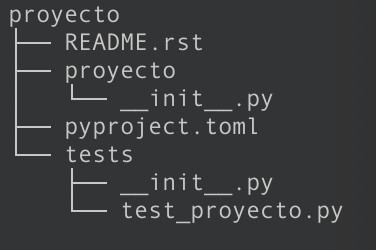

**Instalando Python**

Antes de comenzar a aprender Python necesitamos ... Python, específicamente en este curso utilizaremos Python3.8. 

Instalar Python en:

* **Windows10**

    * Descarga el paquete de instalación desde el sitio oficial de [python](https://www.python.org/downloads/).
    * Una vez descargado el instalador, executa el programa.
    * Asegúrate de seleccionar la opción *Add Python 3.7 to PATH* (si no la ves durante la instalación puedes volver a ejecutar el instalador, elegir la opción de modificar y en la 3era ventana encontrarás la opción)
    *  Continua la instalación por defecto hasta finalizar. 
    *  Listo ahora tienes Python en tu equipo.

    * **NOTA**: Para facilitar las cosas instala [GitBash](https://gitforwindows.org/), es una terminal tipo bash donde podrás ejecutar todos los comandos unix que utilizaremos a lo largo del curso, además de que contiene **git** claro está.

* **Mac**
  
    * Puedes abrir la aplicación *Terminal*

    * Ejecuta el comando:
    
            brew update

    * Una vez finalizado ejecuta el comando 
    
            brew install python@3.8

    * Si ya tenías instalada alguna versión distinta de Python, puedes asignar la versión 3.8 por defecto realizando los pasos indicados [aquí](https://discourse.brew.sh/t/how-to-default-python-3-8-on-my-mac-using-homebrew/7050)

* **Linux (Ubuntu)**

    * Primero actualizamos el repositorio de paquetes 
    
            sudo apt update

    * Preparamos las configuraciones del sistema

            sudo apt install software-properties-common

    * Agregamos deadsnakes PPA a la lista de fuentes de tu sistema 

            sudo add-apt-repository ppa:deadsnakes/ppa

    * Damos **Enter** para continuar

    * Instalamos Python 

            sudo apt install python3.8
    * Verificamos nuestra instalación

            python3.8 --version*

**Preparando el ambiente de desarrollo**

Generalmente cuando comenzamos a aprender un lenguaje de programación, lo primero que queremos es dar nuestro primeros pasos declarando variables, aprender como se declaran las funciones, entre muchas otras cosas. Sin embargo en este curso iniciaremos con algo distinto, *¿Cómo crear un ambiente virtual apropiado para nuestro proyecto?*. 

Antes de crear saber como crear un ambiente virtual, debemos entender que son. Los ambientes virtuales son espacios aislados sin restricción de permisos de usuarios donde podemos gestionar un proyecto con las configuraciones particulares que deseemos. 

Siempre me gusta comparar un ambiente virtual con una casa de árbol dentro de un jardín. La casa del árbol existe dentro de una casa donde existen ciertas reglas, sin embargo, dentro de la casa del árbol las reglas pueden cambiar según nos convenga, es decir, que es un ambiente aislado con sus propias reglas respecto a la casa principal. En esta analogía, la casa principal es nuestro servidor general, ya sea un servidor remoto, un servidor virtual o nuestra computadora en casa, por otro lado, la casa del árbol es el ambiente virtual que tiene sus propias configuraciones. 

Ya que tenemos claro lo que es un ambiente virtual, ahora necesitamos saber como crear uno. Existen diversas herramientas que nos permiten crear ambientes virtuales en Python, ejemplo de ellas son: virtualenv, pipenv, poetry, por mencional algunas. En nuestro caso utilizaremos la última, [poetry](https://python-poetry.org/). 

**Poetry**

Como ya lo hemos mencionado, poetry es una herramienta para el manejo y empaquetamiento de proyectos en Python. Nos va a permitir declarar con que módulos va a contar nuestro proyecto y sus versiones. Esto es importante ya que de esta manera se previene que al compartir el proyecto o cambiar de equipo corramos el riesgo de que algo falle por algún cambio de versión o que no estén instalados todos los módulos necesarios. 

Lo primero que necesitamos es instalar **Poetry** en nuesto equipo:

* **Mac** / **Linux** / **Bashonwindows** 
  * Ejecutamos:  

        curl -sSL https://raw.githubusercontent.com/python-poetry/poetry/master/get-poetry.py | python
* **PowerShell**
  * Ejecutamos : 
  
        (Invoke-WebRequest -Uri https://raw.githubusercontent.com/python-poetry/poetry/master/get-poetry.py -UseBasicParsing).Content | python

Verificamos que la instalación es correcta ejecutando:  *poetry --version*

**NOTA:** En caso de que *python3* no sea tu python por defecto puedes utilizar el siguiente comando para hacer que poetry lo tome por defecto al momento de crear tus ambientes

    alias poetry="python3 $HOME/.poetry/bin/poetry"

**Creando el ambiente de desarrollo**

Ahora que ya contamos con la instalación de poetry, es momento de usarlo para crear nuestro ambiente de desarrollo.

En primer lugar crearemos nuestro paquete de proyecto, dentro de alguna carpeta donde querramos desarrollar nuestro proyecto ejecutamos:

**NOTA:** Cuando veas instrucciones envueltas con llaves, por ejemplo *{nombre_proyecto}* quiere decir que debe ser sustituido por el valor que quieras, incluidas las llave.

    poetry new {nombre_proyecto}

Para nuestro ejemplo {nombre_proyecto} será *proyecto*

Este comando va a crear una carpeta con la siguiente estructura:

<!-- .element style="height: 10px; background: None; box-shadow: None" -->

Veamos de que va cada uno de los archivos generamos.

***README.rst***
Todos los proyectos deben contener un archivo README donde se incluya información del desarrollado, estructura o cualquier información útil sobre el proyecto. La extensión **.rst** refiere a [ReStructuredText](https://es.wikipedia.org/wiki/ReStructuredText), que es un lenguje de marcas ligero. 

***pyproject.toml***
Este es el archivo de configuración generado por poetry, se modificará automáticamente cada que agreguemos o removamos un paquete, por lo tanto, en principio nunca debes modificarlo manualmente. 

***proyecto***
Dentro de esta carpeta es donde se desarrollará todo el proyecto, códigos, módulos interiores, etc.

***tests***
En esta carpeta se definen las pruebas de software y nos servirán para garantizar la estabilidad de nuetro proyecto. Poetry trabaja con [pytest](https://docs.pytest.org/en/latest/) es por eso que los archivos definidos dentro de la carpeta tienen el prefijo *test_*. Detallaremos más adelante sobre este tipo de archivos.

***\_\_init__.py***
Es un tipo de archivo especial dentro de Python que indica que la carpeta que lo contiene puede ser tratada como módulo, también profundizaremos en el futuro sobre el uso de este tipo de archivos y otros semejantes.  

Una vez que nuestro paquete esté listo, accedemos a la carpeta principal de nuestro paquete y ejecutamos

    poetry install

Lo cual instalará todas las dependencias necesarias para iniciar nuestro proyecto

**Accediento al ambiente virtual**

Retomando nuestra analogía de la casa del árbol, todas estas instalaciones las hemos realizado desde la casa principal, entonces ahora, ya construida nuestra casa del árbol, necesitamos acceder a ella de algún modo. Para hacerlo basta con está situados en la raíz de nuestro proyecto, es decir a la altura del archivo *pyproject.toml* y ejecutar el siguiente comando:

    poetry shell

Veremos  que se agrega un prefijo en nuestra terminal envuelto en paréntesis, que refiere al ambiente virtual activado. La

Si has llegado hasta aquí sin errores, **¡Felicidades, bienvenido a la casa del árbol!**.

